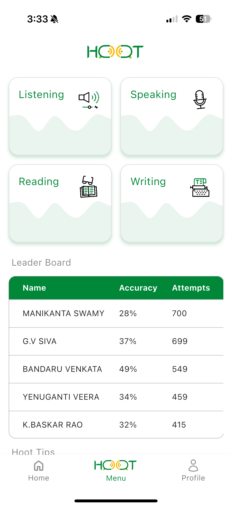
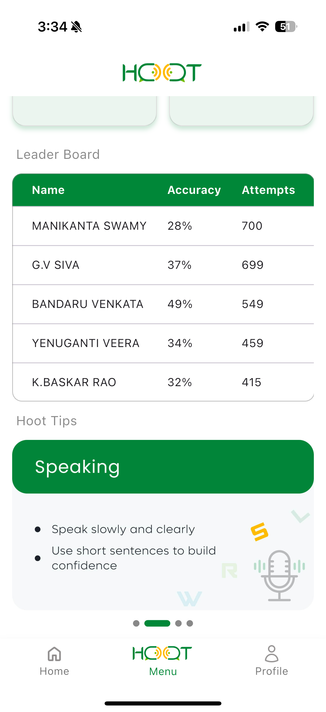

# 🎙️ HOOT – Your AI-Powered English Communication Coach  

🚀 **Project Contribution by Karthikeya Annamraju**  

**HooT** is an AI-powered **English communication** learning platform designed to help **engineering and placement aspirants** excel in:  
✅ **Listening**  
✅ **Reading**  
✅ **Writing**  
✅ **Speaking**  

This app provides **real-time AI-based evaluation**, detailed activity instructions, and aligns with **CEFR standards** for global recognition.  

---

## 🛠 My Contributions  

I contributed to two key modules:  

### 🗣️ **"Give Your Opinion"**  
- Developed a **discussion-based module** where students can express opinions on a given topics.  
- Designed an **engaging UI** to encourage participation.
- Implemented **real-time AI feedback** for sentence structure and clarity.  

### 💬 **"Speaking Situations"**  
- Built an interactive module that presents **real-world scenarios** to help students practice **spoken English**.  
- Integrated **AI-powered speech analysis** for pronunciation improvement.  
- Developed **structured prompts** to guide users through situational conversations.  

---

## 📷 Screenshots of My Work  

---

## 🔗 Project Details  
- **App Status:** ✅ Live & Deployed  
- **Tech Stack:** Flutter, Firebase, AI-based Evaluation System  
- **Codebase Control:** Managed by Technical Hub Private Limited  

Since the **source code is private**, this repository contains **screenshots** and a detailed **case study** of my contributions.  

---

## 📬 Contact  
📧 **Email:** avkarthikeya.dev@gmail.com  
🔗 **LinkedIn:** [Karthikeya Annamraju](https://www.linkedin.com/in/karthikeya-annamraju/)  

💡 Feel free to connect if you'd like to discuss **Flutter, Firebase, or AI-driven applications**! 🚀  
